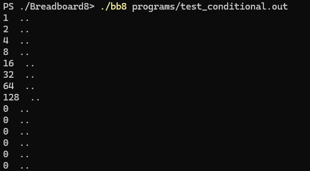
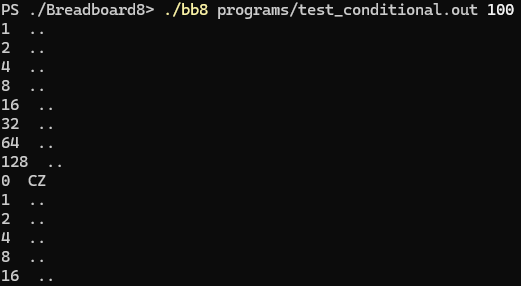

# Follow up on my [Breadboard8mini](https://github.com/minMelody/Breadboard8mini) 8bit cpu emulator

This is an in-depth emulator of Ben Eater's [8 bit breadboard computer](https://youtube.com/playlist?list=PLowKtXNTBypGqImE405J2565dvjafglHU). 
Build the project by running `./make.sh` in a bash evironment, creating `./bb8.exe` using g++.

Build the rom image by running `py makerom.py` with an optional argument for output path.

The cpu runs using a program binary and a rom image with the command `./bb8 <program file> <(optional)rom file>`

## Test program
`test_conditional.out` is designed to output all zeros once a value of 128 is reached when the microcode contains no conditional jump instructions.

Meanwhile a working jump if carry will execute on a loop.

## TODO
- [ ] implement JC
- [ ] implement JZ
