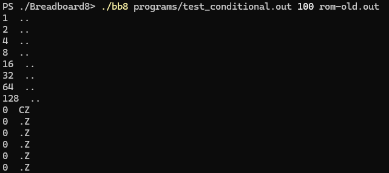

# Follow up on my [Breadboard8mini](https://github.com/minMelody/Breadboard8mini) 8bit cpu emulator

This is an in-depth emulator of Ben Eater's [8 bit breadboard computer](https://youtube.com/playlist?list=PLowKtXNTBypGqImE405J2565dvjafglHU) down to the micro instructions.

Build the project by running `make`, this creates a `bb8` & `eas` executables using g++, as well as the `rom.out` image making use of numpy.

Run the emulator using `./bb8 <program file> <clock speed> [rom image]`. rom image loads `rom.out` by default.

## Screenshot

## Editing the microcode

The makerom python script is based on Ben Eater's arduino [EEPROM programmer](https://github.com/beneater/eeprom-programmer).
Edit the template to add instructions. 
When changing the micro-instruction definitions make sure to edit both the python script and `core/include/microcode.h`.

Running `python3 makerom.py` outputs the rom image in `rom.out`, unless a different file is specified.

## Writing your own program
See [the readme file](https://github.com/minMelody/Breadboard8/blob/main/assembler/README.md) for assembler syntax.
Run `./eas <source code> [output path]` to assemble your code. If no output path is specified a `a.out` file will be created.

## Test program
When the microcode contains no jump if carry, `shiftleft.out` outputs all zeros once a value greater than 128 is reached:

Meanwhile a working jump if carry will execute in a loop:

